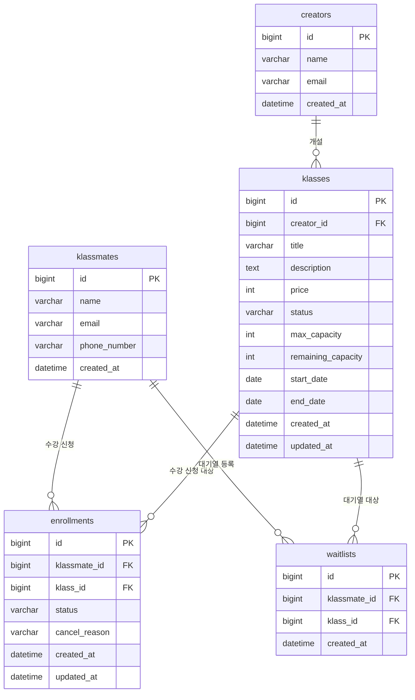

# DB 스키마

| 작성일 | 수정일 |
|---|---|
| 2026-05-17 | 2026-05-17 |

## 환경

| 항목 | 내용 |
|---|---|
| 운영 환경 | MySQL |
| 테스트 환경 | H2 (인메모리) |

## 목차
- [creators](#creators)
- [klassmates](#klassmates)
- [klasses](#klasses)
- [enrollments](#enrollments)
- [waitlists](#waitlists)
- [테이블 관계](#테이블-관계)

---

## creators

| 필드 | 타입 | 제약 | 설명 |
|---|---|---|---|
| id | BIGINT | PK, AUTO_INCREMENT | 강사 식별자 |
| name | VARCHAR(10) | NOT NULL | 이름 |
| email | VARCHAR(255) | UNIQUE, NOT NULL | 이메일 |
| created_at | DATETIME | NOT NULL | 가입 시각 |

---

## klassmates

| 필드 | 타입 | 제약 | 설명 |
|---|---|---|---|
| id | BIGINT | PK, AUTO_INCREMENT | 수강생 식별자 |
| name | VARCHAR(10) | NOT NULL | 이름 |
| email | VARCHAR(255) | UNIQUE, NOT NULL | 이메일 |
| phone_number | VARCHAR(20) | NOT NULL | 전화번호 |
| created_at | DATETIME | NOT NULL | 가입 시각 |

---

## klasses

| 필드 | 타입 | 제약 | 설명 |
|---|---|---|---|
| id | BIGINT | PK, AUTO_INCREMENT | 강의 식별자 |
| creator_id | BIGINT | FK → creators(id), NOT NULL | 강사 |
| title | VARCHAR(20) | NOT NULL | 강의명 |
| description | TEXT | - | 강의 설명 |
| price | INT | NOT NULL | 수강료 |
| status | VARCHAR(20) | NOT NULL | 강의 상태 (`DRAFT`, `OPEN`, `CLOSED`) |
| max_capacity | INT | NOT NULL | 최대 수강 정원 |
| remaining_capacity | INT | NOT NULL | 현재 신청 가능 인원 |
| start_date | DATE | - | 수강 시작일 (null이면 무제한) |
| end_date | DATE | - | 수강 종료일 (null이면 무제한) |
| created_at | DATETIME | NOT NULL | 등록 시각 |
| updated_at | DATETIME | NOT NULL | 마지막 수정 시각 |

---

## enrollments

| 필드 | 타입 | 제약 | 설명 |
|---|---|---|---|
| id | BIGINT | PK, AUTO_INCREMENT | 수강 신청 식별자 |
| klassmate_id | BIGINT | FK → klassmates(id), NOT NULL | 수강생 |
| klass_id | BIGINT | FK → klasses(id), NOT NULL | 강의 |
| status | VARCHAR(20) | NOT NULL | 수강 신청 상태 (`PENDING`, `CONFIRMED`, `CANCELLED`) |
| cancel_reason | VARCHAR(30) | - | 취소 사유 (`PAYMENT_TIMEOUT`, `USER_REQUESTED`). status가 CANCELLED일 때만 값 존재 |
| created_at | DATETIME | NOT NULL | 신청 시각 |
| updated_at | DATETIME | NOT NULL | 마지막 수정 시각 |

**제약 조건**
- 조건부 유니크 인덱스: `(klassmate_id, klass_id)` — CANCELLED 상태 제외. 동일 강의에 대한 중복 수강 신청 방지 (CANCELLED 후 재신청은 허용)

---

## waitlists

| 필드 | 타입 | 제약 | 설명 |
|---|---|---|---|
| id | BIGINT | PK, AUTO_INCREMENT | 대기열 식별자 |
| klassmate_id | BIGINT | FK → klassmates(id), NOT NULL | 수강생 |
| klass_id | BIGINT | FK → klasses(id), NOT NULL | 강의 |
| created_at | DATETIME | NOT NULL | 등록 시각 (대기 순서 기준) |

**제약 조건**
- UNIQUE: `(klassmate_id, klass_id)` — 동일 강의 중복 대기열 등록 방지

**인덱스**
- `(klass_id, created_at)` — 대기열 처리 시 특정 강의의 대기자를 등록 순서대로 조회하기 위함

---

## 테이블 관계

